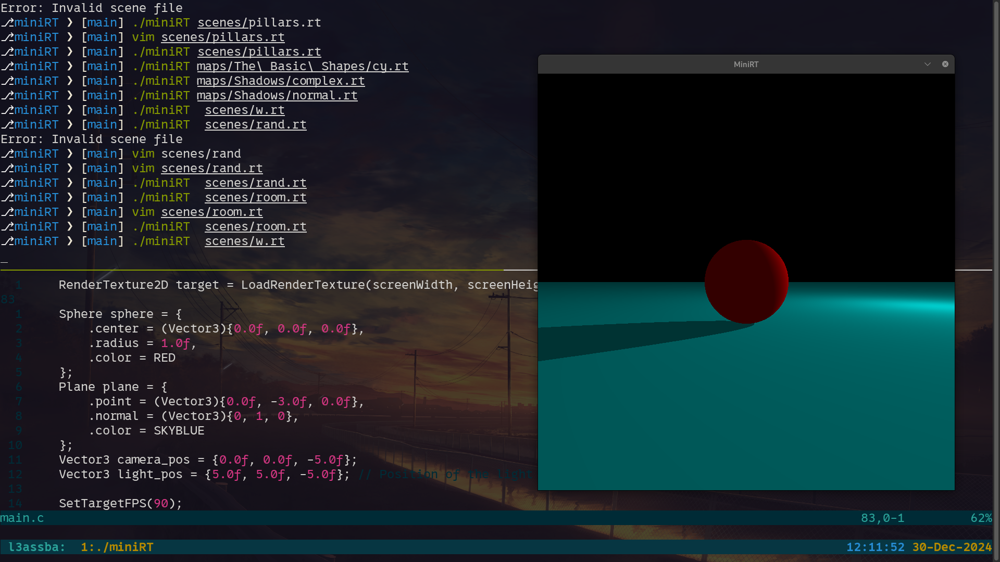

# MiniRT
A minimalist ray tracer implementation in C

```javascript
const MiniRT = {
  "description": "A minimalist ray tracer implementation in C",
  "features": ["Ray tracing", "3D Objects", "Lighting", "Shadows"],
  "objects": ["Sphere", "Plane", "Cylinder"],
  "usage": "make && ./miniRT scene.rt",
  "dependencies": ["MinilibX", "Math Library"]
}
```
<div align="center">



</div>
