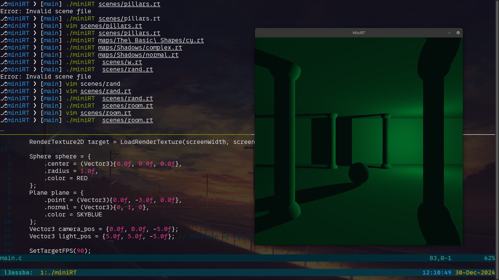

# MiniRT
```javascript
const MiniRT = {
  "description": "minimalist ray tracer implementation in C",
  "features": ["Ray tracing", "3D Objects", "Lighting", "Shadows"],
  "objects": ["Sphere", "Plane", "Cylinder"],
  "usage": "cd miniRT && make && ./miniRT scenes/box.rt",
  "dependencies": ["MinilibX", "Math Library"]
}
```
<div align="center">

<h2>✨ Gallery</h2>

<table>

<tr>

<td align="center">

<br/>

<sub><b>Sphere with Lighting</b></sub>

</td>

<td align="center">

<br/>

<sub><b>Cylender Object Scene</b></sub>

</td>

</tr>

<tr>

<td align="center">

<br/>

<sub><b>Shadow Demonstration</b></sub>

</td>

<td align="center">

<br/>

<sub><b>Complex Scene Rendering</b></sub>

</td>

</tr>

</table>

<details>

<summary>🎨 More Renders</summary>

<br>

<table>

<tr>

<td align="center">

<br/>

<sub><b>Additional Scene 1</b></sub>

</td>

<td align="center">

<br/>

<sub><b>Additional Scene 2</b></sub>

</td>

<td align="center">

<br/>

<sub><b>Additional Scene 3</b></sub>

</td>

</tr>

</table>

</details>

<br>

<p>


</p>

</div>
